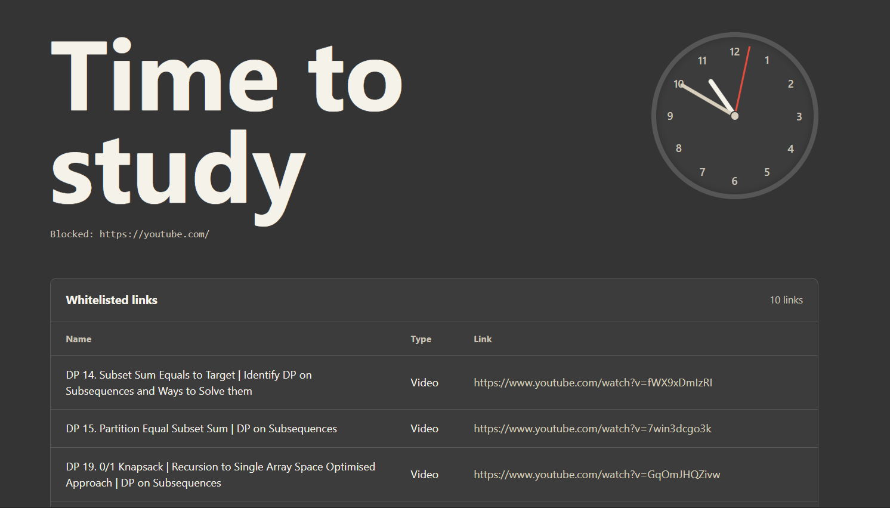

<div align="center">
  
  <h1>Lockin</h1>
  <p><strong>Stay completely focused and locked in by turning YouTube into a highly intentional learning tool.</strong></p>
</div>

---

## 🎯 What is Lockin?

YouTube is packed with extremely valuable educational content, but it's deliberately engineered to side-track you with highly addictive short-form videos and irrelevant recommendations. 

**Lockin** is a purpose-built Chrome Extension designed to take back your attention. Instead of completely blocking YouTube out of your life, Lockin explicitly disables the general algorithm and forces you to pre-define the exact videos or playlists you are allowed to watch. If a video is not on your whitelist, you simply cannot view it. 

### ✨ Features
- **Strict Video Whitelisting**: Only allow explicit educational or necessary videos to play.
- **Playlist Unlocking**: Whitelist entire playlists securely. 
- **The Lockscreen**: A beautiful, minimal distraction-free block screen with a live responsive analog clock designed to anchor you back to reality.
- **Password Locking**: Optionally safeguard your whitelist settings by requiring a passcode to change overrides.
- **Temporary Bypasses**: Give yourself a quick 2-min, 5-min, or 10-min bypass when you legitimately need to break focus for a bit.

## 📸 Screenshot



---

## 🛠️ Tech Stack & Architecture
- **Framework**: Minimal vanilla TypeScript & HTML.
- **Bundler**: Built with [Vite](https://vitejs.dev/) and powered by `@crxjs/vite-plugin` for seamless hot-reloading in Chrome Extension environments.
- **Styling**: Hand-crafted CSS engineered for perfect minimal aesthetics.

---

## 🚀 Getting Started for Development

Do you want to run Lockin locally or contribute to the project? Setup is fast and simple.

### Prerequisites
- [Node.js](https://nodejs.org/en/) (Version 16+ highly recommended)
- Git 

### 1. Installation
Clone the repository to your local machine and install the dependencies:
```bash
git clone https://github.com/Akshansh-Sinha/Lockin-YoutubeBlocker-Extension.git
cd Lockin-YoutubeBlocker-Extension
npm install
```

### 2. Building the Project
To compile the TypeScript framework and package everything into the static `dist/` directory, simply run:
```bash
npm run build
```

---

## 📦 Loading the Extension into Chrome

Because this is a locally built developer setup, you must manually load it into your Chrome browser:

1. Open your browser and navigate to `chrome://extensions/`.
2. Toggle on **Developer mode** in the top right corner.
3. Click the **Load unpacked** button.
4. Select the `dist` folder located inside your cloned `Lockin-YoutubeBlocker-Extension` directory.
5. Setup complete! The extension should successfully boot up in your toolbar.

> **Note on Updates**: Any time you pull new code or run `npm run build`, you may need to navigate back to `chrome://extensions` and explicitly press the circular "Reload" icon to bypass aggressive web caching! 

---

## 💡 Detailed Usage Workflow

Lockin uses an aggressive default-deny approach: the moment you enable it, **the entire YouTube algorithm is locked.** If you surf to `youtube.com`, you will instantly be met with the Lockin interface. 

To use YouTube intentionally, follow these steps to manage your study sessions effectively:

### 1. Whitelisting Specific Content
You can whitelist any URL directly from YouTube, whether it is a singular educational video or an entire playlist.
- Copy the exact YouTube web URL. 
- Open the Lockin popup from your toolbar.
- In the **Add link** section, assign a descriptive name (optional) and paste the URL.
- Once added, that video is officially approved. You can explore your organized whitelist directly beneath the **Videos** and **Playlists** headers. By clicking on them inside the extension, Lockin will safely bypass the block screen and drop you right into the video.

### 2. Temporary Unlocks
If you genuinely need to explore the platform to research something or take a brief break, use a **Temporary Unlock**.
- Inside the extension UI, locate the **Temporary unlock** section.
- Click either **2 min**, **5 min**, or **10 min**. 
- The entire YouTube website will be functionally unlocked for that strict window. Once the countdown expires, Lockin aggressively rears its head and blocks the site once more.

### 3. Overriding & Disabling
If you are done studying for the day and want to turn Lockin off completely:
- Hit the red **Disable** button inside the extension popup.
- You will be prompted to type the exact phrase: **"I have completed my studies"**
- Submit it to confirm your intent and remove the blockers.
- You can instantly re-enable the blocker anytime via the **Enable blocking** button!
